# Cat Auto Encoder Compressor (CAEC)

An image compressor based on an auto-encoder architecture designed for compressing images of cats.

## Usage

Compression:

```
python -m src.scripts.compress --config configs/compressor.yaml \
-s datasets/test/cat_1.bmp -t cat_1.cat
```

Decompression:

```
python -m src.scripts.decompress --config configs/compressor.yaml \
-s cat_1.cat -t cat_1.bmp
```

## Methods

Obviously, the code is based on the parent repository (https://github.com/alexandru-dinu/cae).

### Architecture

The compressor is based on an auto-encoder architecture inspired by [1] and [2]. It is a lightweight convolutional
neural network working on 128x128 patches of an image. It can therefore be easily adapted to work with images of
arbitrary size.

### Quantization

I have tested two methods of quantization:

* Stochastic binarization [2]:

  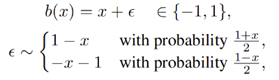
* Uniform quantization [3]:

  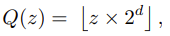

### Dataset

The model was trained and tested on ~10k images of cats taken
from [Kaggle cat dataset](https://www.kaggle.com/crawford/cat-dataset), resized to 1280x768
with [Lanczos resampling](https://en.wikipedia.org/wiki/Lanczos_resampling). The dataset was randomly splitted into two
subsets:`train` and `test` with ratio 95:5.

### Experimental setup

## Models comparison

Here is an average [PSNR](https://en.wikipedia.org/wiki/Peak_signal-to-noise_ratio)
, [SSIM](https://en.wikipedia.org/wiki/Structural_similarity) and compressed image size computed on the `test` dataset
for various models and the JPEG baseline.

Model | PSNR | SSIM | Latent dim | Img Size (kB)
:---: | :---: | :---: | :---: | :---:
Uniform small d=4 | 28.81 ± 0.54 | 0.6647 ± 0.0715 | 1024 | 30.0 ± 0.0
Uniform small d=8 | 31.01 ± 0.99 | 0.7801 ± 0.1003 | 1024 | 60.0 ± 0.0
Uniform medium d=4 | 29.41 ± 0.49 | 0.7346 ± 0.0620 | 4096 | 120.0 ± 0.0
Uniform medium d=8 | 34.94 ± 2.15 | 0.9206 ± 0.0479 | 4096 | 240.0 ± 0.0
Stochastic small | 30.08 ± 0.82 | 0.6801 ± 0.1357 | 1024 | 7.5 ± 0.0
Stochastic medium | 31.05 ± 1.01 | 0.7670 ± 0.0931 | 4096 | 30.0 ± 0.0
Stochastic big | 31.38 ± 1.15 | 0.8777 ± 0.0556 | 32768 | 240.0 ± 0.0
JPEG | 39.02 ± 3.08 | 0.9796 ± 0.0163 | - | 115.57 ± 38.55

## Samples

Model | Cat 1 | Cat 2 | Cat 3
:---: | :---: | :---: | :---:
Original |  |   | 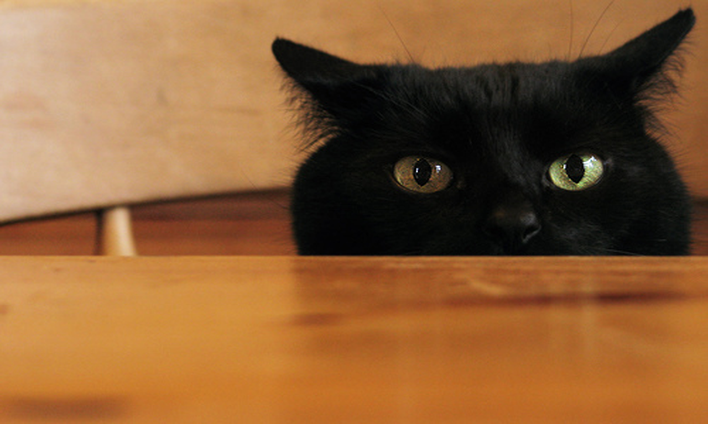
Uniform small d=8 | 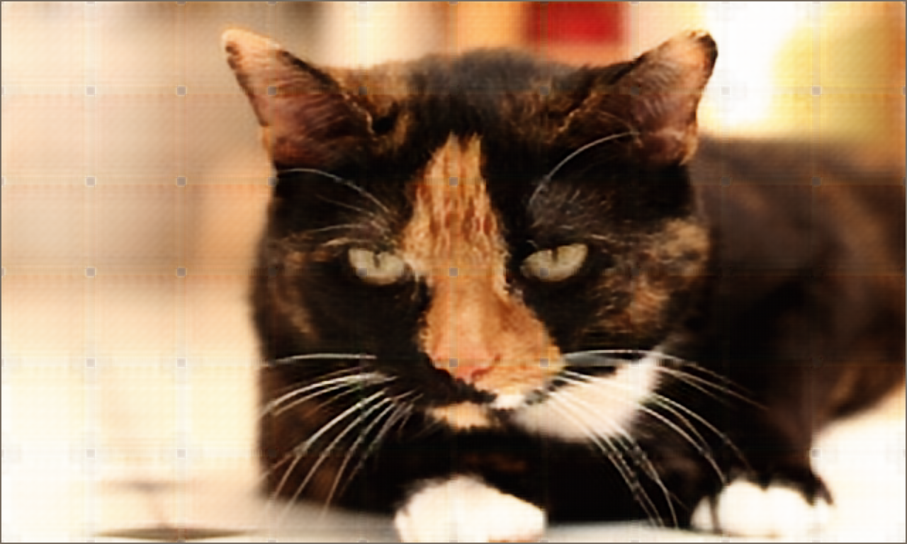 |   | 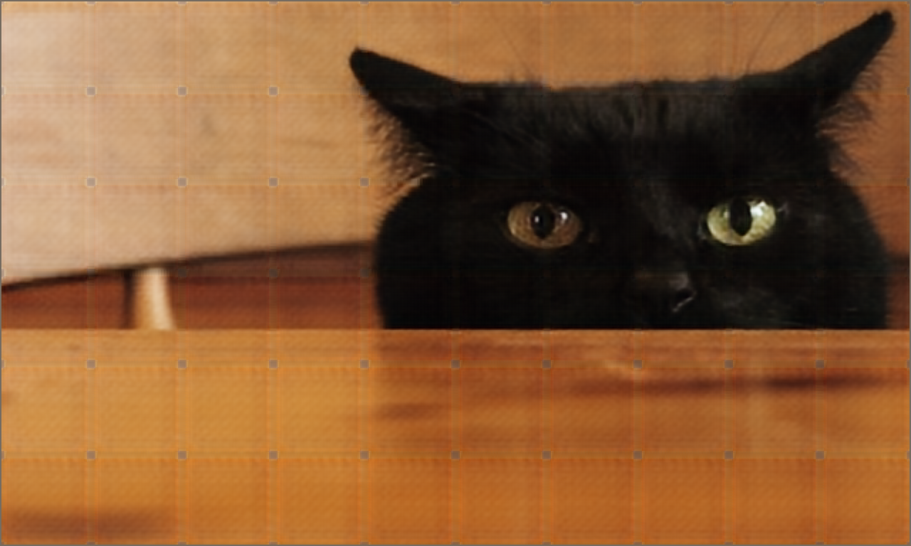
Uniform medium d=4 | 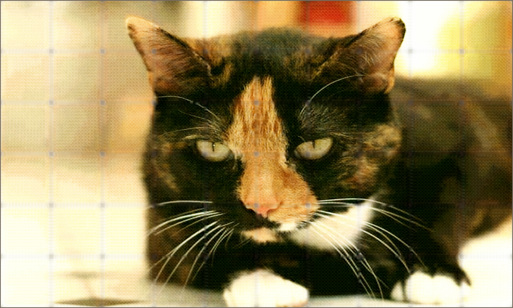 |  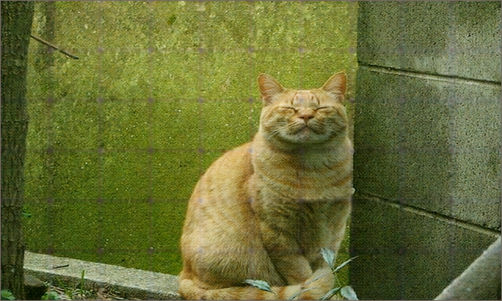 | 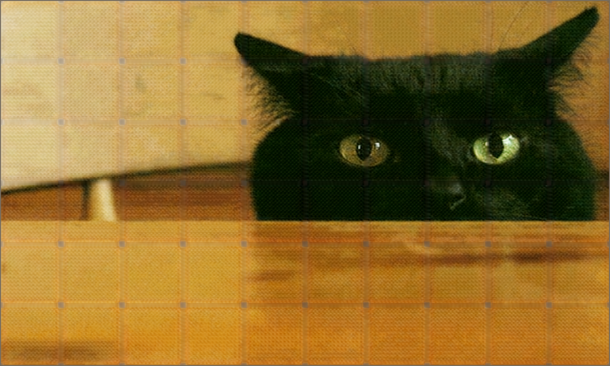
Uniform medium d=8 |  |   | 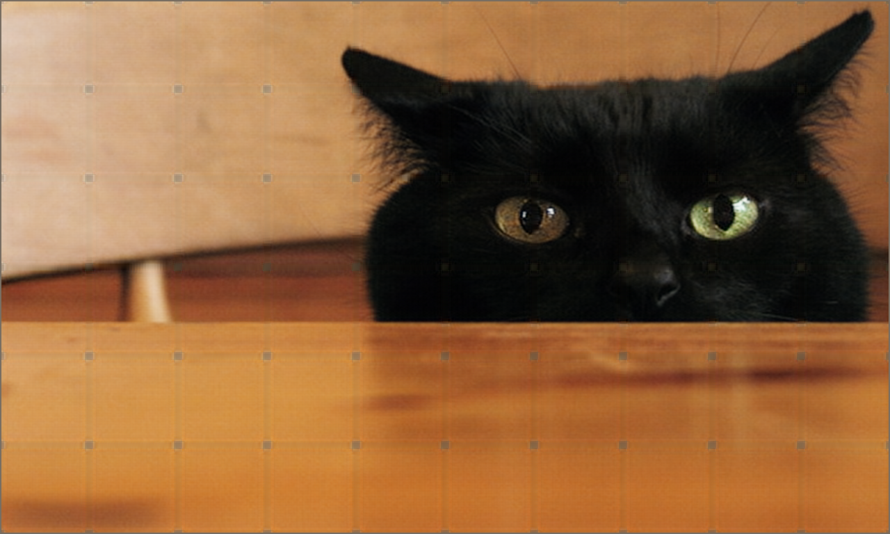
Stochastic medium | 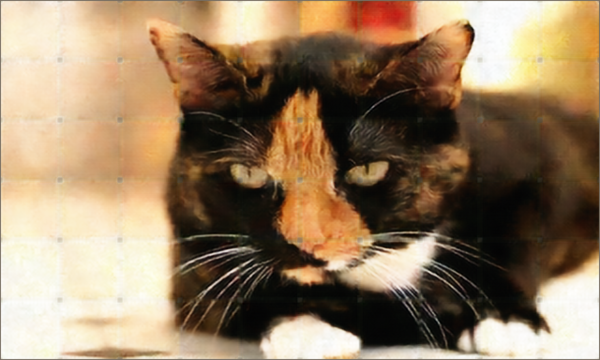 |  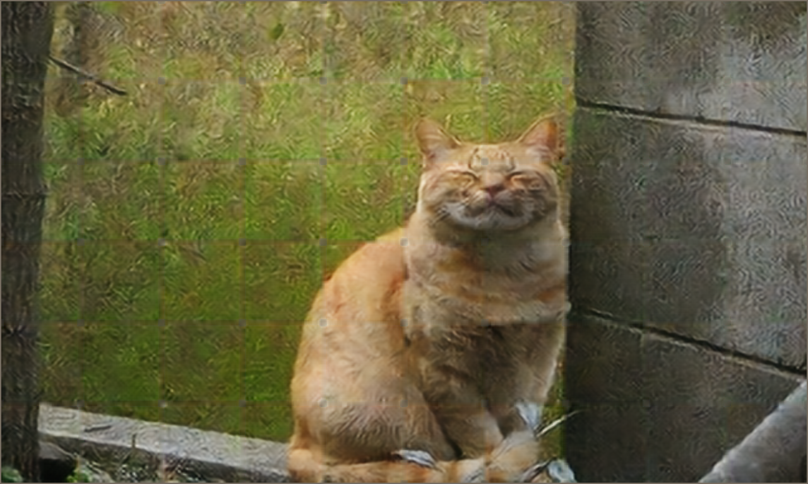 | 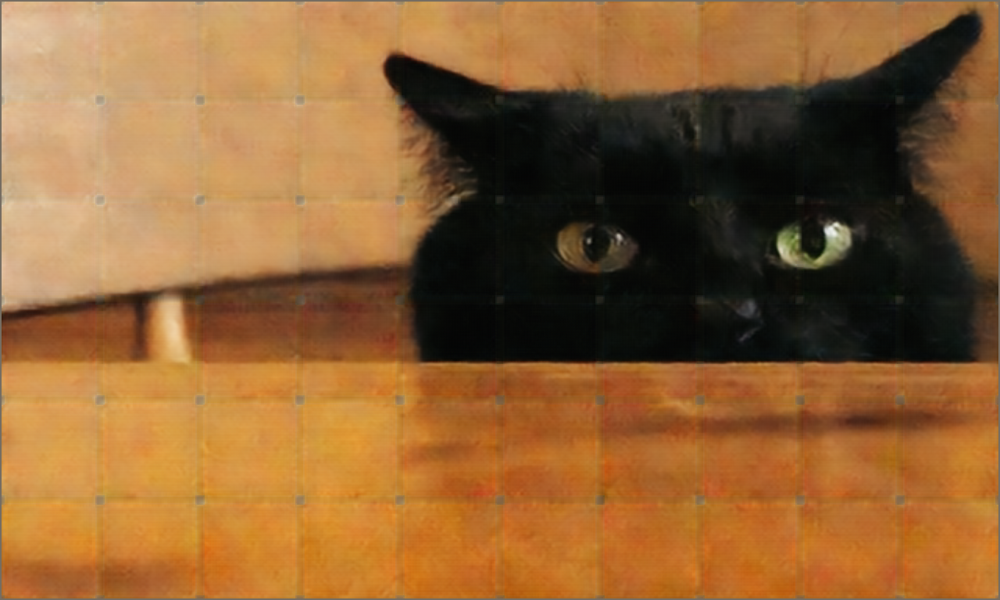
Stochastic big | 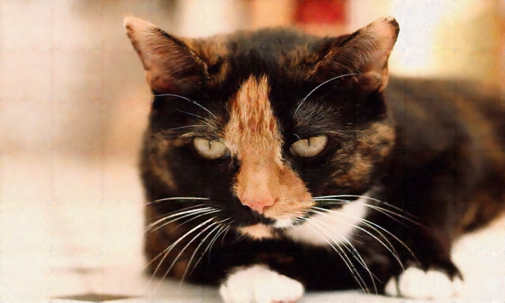 |  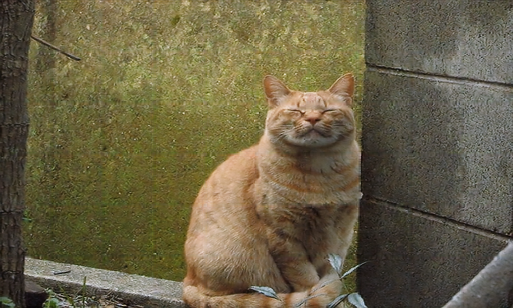 | 
JPEG |  |  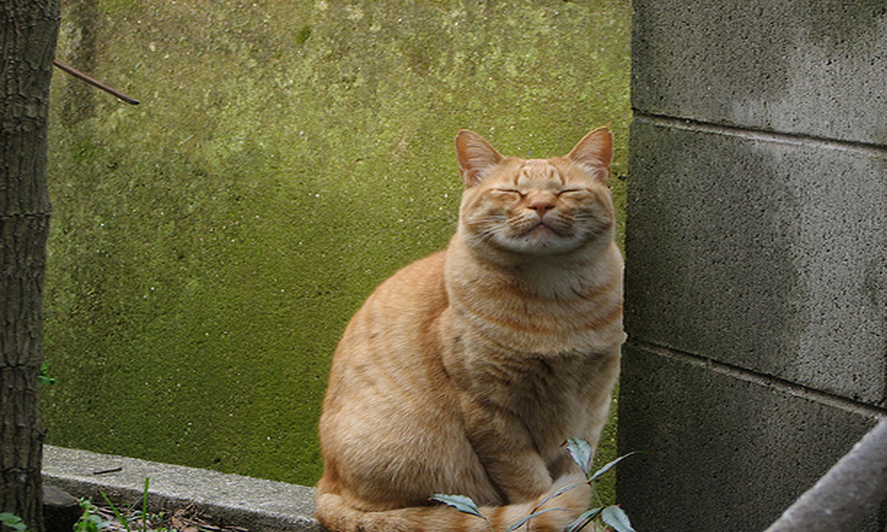 | 

## References

- [1] [Lossy Image Compression with Compressive Autoencoders, Theis et al.](https://arxiv.org/abs/1703.00395)
- [2] [Variable Rate Image Compression with Recurrent Neural Networks, Toderici et al.](http://arxiv.org/abs/1511.06085)
- [3] [An Autoencoder-based Learned Image Compressor:
  Description of Challenge Proposal by NCTU, Alexandre et al.](https://arxiv.org/abs/1902.07385)
